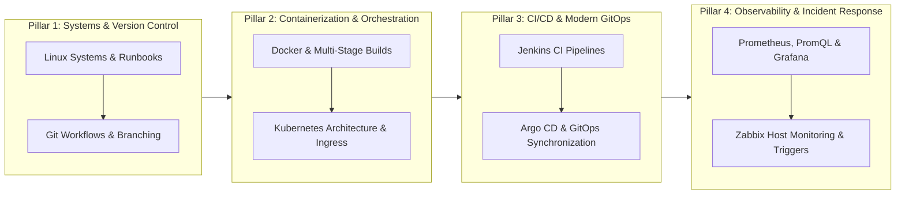

# DevOps & Cloud Engineering Interview Preparation Handbook 🚀

[](https://github.com/)
[](./kubernetes_cheat_sheet.txt)
[](./docker_cheat_sheet.txt)
[](./linux_cheat_sheet.txt)
[](./git_cheat_sheet.txt)
[](./jenkins_cheat_sheet.txt)
[](./argocd_cheat_sheet.txt)
[](./prometheus_grafana_cheat_sheet.txt)
[](./prometheus_grafana_cheat_sheet.txt)
[](./zabbix_cheat_sheet.txt)

A battle-tested, high-density collection of interview cheat sheets, architecture blueprints, CLI references, and incident runbooks designed for **DevOps Engineers, Site Reliability Engineers (SREs), Platform Engineers, and Cloud Architects**.

Each cheat sheet is structured specifically for technical interviews: conceptual definitions, CLI command tables, ASCII architecture diagrams, core comparison matrices, and real-world failure troubleshooting runbooks.

---

## 📑 Table of Contents

- [Quick Navigation Matrix](#-quick-navigation-matrix)
- [4-Pillar Recommended Study Roadmap](#-4-pillar-recommended-study-roadmap)
- [Module Highlights & Core Interview Concepts](#-module-highlights--core-interview-concepts)
  - [1. Linux for DevOps](#1-linux-for-devops)
  - [2. Git & Version Control](#2-git--version-control)
  - [3. Docker & Containerization](#3-docker--containerization)
  - [4. Kubernetes (K8s) Orchestration](#4-kubernetes-k8s-orchestration)
  - [5. Jenkins CI/CD Automation](#5-jenkins-cicd-automation)
  - [6. Argo CD & GitOps Continuous Delivery](#6-argo-cd--gitops-continuous-delivery)
  - [7. Prometheus & Grafana Observability](#7-prometheus--grafana-observability)
  - [8. Zabbix Enterprise Monitoring](#8-zabbix-enterprise-monitoring)
- [Production Incident Runbooks](#-production-incident-runbooks)
- [Repository Structure](#-repository-structure)
- [Interview Preparation Tips](#-interview-preparation-tips)

---

## ⚡ Quick Navigation Matrix

| Topic | Cheat Sheet File | Core Focus & Coverage | Target Interview Questions |
| :--- | :--- | :--- | :--- |
| **Linux** | [`linux_cheat_sheet.txt`](./linux_cheat_sheet.txt) | FHS, text processing (`grep`, `sed`, `awk`), networking (`ip`, `ss`, `curl`), permissions, systemd, runbooks. | Load averages, `lsof +L1`, Inode exhaustion, SIGTERM vs SIGKILL, Hard vs Soft links. |
| **Git** | [`git_cheat_sheet.txt`](./git_cheat_sheet.txt) | 3 Local Zones + Remote, CLI commands, branching models, merge conflict workflow. | Merge vs Rebase, Reset modes (`--soft`/`--mixed`/`--hard`), Fetch vs Pull, Trunk-Based vs GitFlow. |
| **Docker** | [`docker_cheat_sheet.txt`](./docker_cheat_sheet.txt) | Dockerfile instructions, image lifecycle, build flags, multi-stage builds. | `RUN` vs `CMD` vs `ENTRYPOINT`, `ARG` vs `ENV`, `COPY` vs `ADD`, `EXPOSE` vs `-p`. |
| **Kubernetes** | [`kubernetes_cheat_sheet.txt`](./kubernetes_cheat_sheet.txt) | Objects, Control Plane `"A E S C"` architecture, traffic routing, deployment flows, RBAC. | StatefulSet vs Deployment, Ingress routing flow, `kubectl apply` lifecycle, ClusterIP vs NodePort. |
| **Jenkins** | [`jenkins_cheat_sheet.txt`](./jenkins_cheat_sheet.txt) | Controller/Agent remoting, Declarative vs Scripted, `post` conditions, K8s dynamic agents. | Freestyle vs Pipeline, pollSCM vs Webhook, Pipeline-as-Code, Production `Jenkinsfile`. |
| **Argo CD** | [`argocd_cheat_sheet.txt`](./argocd_cheat_sheet.txt) | CRDs (`Application`, `AppProject`, `ApplicationSet`), Sync/Health states, Sync Waves, Hooks. | Push vs Pull GitOps, Auto-Sync vs Self-Healing, Sync Waves vs Phases, Drift reconciliation. |
| **Prometheus & Grafana** | [`prometheus_grafana_cheat_sheet.txt`](./prometheus_grafana_cheat_sheet.txt) | TSDB, 4 metric types, PromQL queries, Grafana dashboards, Golden Signals. | Pull vs Push model, `rate()` vs `irate()`, Histogram vs Summary, 4 Golden Signals. |
| **Zabbix** | [`zabbix_cheat_sheet.txt`](./zabbix_cheat_sheet.txt) | Server/Proxy/Agent architecture, LLD, item keys, trigger expressions, Zabbix vs Prometheus. | Active vs Passive checks, Agent 1 (C) vs Agent 2 (Go), Zabbix vs Prometheus, LLD automation. |

---

## 🗺️ 4-Pillar Recommended Study Roadmap

To prepare effectively for technical interviews, tackle these topics in four progressive phases:



1. **Pillar 1: Systems & Core Tooling (Foundations)**
   - Master Linux internals, process trees, networking diagnostics, and shell tools.
   - Solidify Git commit graphs, branch lifecycles, and rebase vs merge mechanics.
2. **Pillar 2: Containerization & Cloud-Native Orchestration**
   - Learn Dockerfile layer caching, multi-stage optimization, and container lifecycles.
   - Master Kubernetes control-plane components, networking (Ingress/Services), storage binding, and scheduling.
3. **Pillar 3: CI/CD Automation & GitOps Delivery**
   - Understand CI build agents, Declarative `Jenkinsfile` structure, and dynamic Pod workers.
   - Adopt GitOps principles with Argo CD: declarative state, automated reconciliation, and sync wave ordering.
4. **Pillar 4: Observability & Enterprise Monitoring**
   - Distinguish time-series metrics (Prometheus) from host/agent metrics (Zabbix).
   - Write PromQL queries for SLOs/SLIs, construct Grafana dashboards, and apply the 4 Golden Signals.

---

## 🔍 Module Highlights & Core Interview Concepts

### 1. Linux for DevOps
📄 **File:** [`linux_cheat_sheet.txt`](./linux_cheat_sheet.txt)

- **Filesystem Hierarchy Standard (FHS):**
  - `/proc`: Virtual filesystem exposing kernel metrics and running process memory.
  - `/sys`: Hardware devices, drivers, and kernel subsystem configuration.
  - `/etc`: Host-wide configuration files (`hosts`, `resolv.conf`, `systemd`).
  - `/var`: Variable state data (`/var/log`, `/var/spool`).
- **High-Frequency Interview Distinctions:**
  - **Hard Link vs Soft Link (Symlink):** A hard link shares the exact disk inode (data survives original deletion; cannot cross filesystems). A soft link is a pointer path string (breaks if target is moved; can span filesystems).
  - **`SIGTERM` (15) vs `SIGKILL` (9):** `SIGTERM` requests graceful shutdown (can be intercepted and handled for clean resource release). `SIGKILL` causes immediate, uncatchable termination by the kernel.
  - **Process vs Thread:** Processes have isolated virtual memory spaces. Threads share the address space of their parent process.
  - **Buffer vs Cache:** Buffer caches raw disk blocks for pending I/O; Cache stores cached file pages in RAM for read speed.

---

### 2. Git & Version Control
📄 **File:** [`git_cheat_sheet.txt`](./git_cheat_sheet.txt)

- **The 3 Local Zones (+ Remote):**
  ```text
  Working Directory   --->   Staging Area (Index)   --->   Local Repository   --->   Remote Repo
     (Unstaged)                 (git add)                    (git commit)             (git push)
  ```
- **High-Frequency Interview Distinctions:**
  - **`git merge` vs `git rebase`:**
    - `merge`: Preserves branch history with a non-destructive explicit merge commit.
    - `rebase`: Replays commits linearly onto a new base commit, creating a clean linear graph (rewrites commit hashes).
  - **`git reset` Modes:**
    - `--soft`: Moves HEAD backward; leaves your changes in **Staging Area**.
    - `--mixed` *(default)*: Moves HEAD backward; leaves changes in **Working Directory** (unstaged).
    - `--hard`: Moves HEAD backward; **permanently erases** all uncommitted changes.
  - **Branching Strategies:**
    - **Trunk-Based Development:** Preferred for DevOps/CI/CD. Small, short-lived branches (< 1 day) merged into `main` behind feature flags.
    - **GitFlow:** Traditional, heavy model using `main`, `develop`, `feature/*`, `release/*`, and `hotfix/*`.

---

### 3. Docker & Containerization
📄 **File:** [`docker_cheat_sheet.txt`](./docker_cheat_sheet.txt)

- **Core Lifecycle Pipeline:**
  ```text
  [ Dockerfile ]  ──(docker build)──>  [ Docker Image ]  ──(docker run)──>  [ Running Container ]
  ```
- **High-Frequency Interview Distinctions:**
  - **`RUN` vs `CMD` vs `ENTRYPOINT`:**
    - `RUN`: Executes at **build time** and commits the resulting layer into the image.
    - `CMD`: Specifies default command/arguments at **runtime**; easily overridden via CLI arguments (`docker run myimage /bin/bash`).
    - `ENTRYPOINT`: Sets the primary runtime executable; not overridden by normal arguments (arguments are appended).
  - **`ARG` vs `ENV`:**
    - `ARG`: Available **only during build time** via `--build-arg`; not retained in running containers.
    - `ENV`: Available during **both build time and runtime**; persists inside the container environment.
  - **`COPY` vs `ADD`:**
    - `COPY`: Standard, transparent host-to-image file copying (recommended).
    - `ADD`: Extra features (auto-extracts `.tar` archives, downloads remote URLs).

---

### 4. Kubernetes (K8s) Orchestration
📄 **File:** [`kubernetes_cheat_sheet.txt`](./kubernetes_cheat_sheet.txt)

- **Control Plane Memory Trick (`"A E S C"`):**
  - **A** -> `kube-apiserver`: The gateway and REST interface; validates and processes all requests.
  - **E** -> `etcd`: The distributed key-value store holding the complete cluster state.
  - **S** -> `kube-scheduler`: Assigns unscheduled Pods to suitable worker nodes based on resources, affinities, and taints.
  - **C** -> `kube-controller-manager`: Runs reconciliation loops (Node Controller, ReplicaSet Controller) ensuring current state equals desired state.
- **Worker Node Architecture:**
  - `kubelet`: The node agent communicating with the API server to manage container lifecycles.
  - `kube-proxy`: Network proxy managing iptables/IPVS rules for Service traffic routing.
  - `container runtime`: Low-level engine (containerd, CRI-O) executing containers.
- **Step-by-Step Traffic Ingress Flow:**
  ```text
  Internet Client ──> Cloud Load Balancer ──> Ingress Controller (L7) ──> ClusterIP Service (L4) ──> Pod Virtual IP ──> Container Port
  ```
- **Key Comparisons:**
  - **Deployment vs StatefulSet:** Deployments manage interchangeable stateless Pods with randomized hashes. StatefulSets manage stateful Pods with sticky identities (`db-0`, `db-1`) and dedicated persistent storage.
  - **ResourceQuota vs LimitRange:** `ResourceQuota` limits total resources for an entire Namespace; `LimitRange` sets default/min/max resource constraints per individual Pod/Container.

---

### 5. Jenkins CI/CD Automation
📄 **File:** [`jenkins_cheat_sheet.txt`](./jenkins_cheat_sheet.txt)

- **Architecture:** Controller (manages configs, schedules jobs, hosts UI) + Distributed Agents (executes build steps via SSH or JNLP remoting on port 50000).
- **Declarative vs Scripted Pipeline:**
  | Feature | Declarative Pipeline (`pipeline {}`) | Scripted Pipeline (`node {}`) |
  | :--- | :--- | :--- |
  | **Syntax Style** | Strict, structured DSL | Groovy procedural programming |
  | **Syntax Checking** | Validated before execution begins | Dynamic runtime failures |
  | **Recommendation** | Official standard for modern CI/CD | Legacy / Complex custom loops |
- **The `post` Block Execution Conditions:**
  - `always`: Runs regardless of completion status.
  - `success`: Runs only if build succeeds.
  - `failure`: Runs on build error (triggers alerts).
  - `unstable`: Runs if tests fail or warnings are raised.
  - `changed`: Runs only if build state differs from the previous run.
- **Modern Pattern:** Ephemeral Kubernetes Pod Agents where Jenkins dynamically creates Pods to run builds and destroys them upon completion.

---

### 6. Argo CD & GitOps Continuous Delivery
📄 **File:** [`argocd_cheat_sheet.txt`](./argocd_cheat_sheet.txt)

- **What is GitOps?** An operational model where Git is the single source of truth for desired infrastructure and application state.
- **Argo CD Architecture:**
  - `API Server`: Exposes Web UI and CLI endpoints.
  - `Repository Server`: Caches Git repositories and renders Helm/Kustomize manifests.
  - `Application Controller`: Continuously reconciles live cluster state against Git.
  - `Redis`: Caching layer for manifests and cluster state.
- **Key Capabilities:**
  - **Auto-Sync:** Deploys new manifests automatically when commits hit Git.
  - **Self-Healing:** Overwrites manual cluster changes to prevent configuration drift.
  - **Pruning:** Automatically deletes live Kubernetes resources when removed from Git.
  - **Sync Waves & Hooks:** Control phased rollouts (`PreSync` DB migrations -> `Sync` application -> `PostSync` smoke tests) using `argocd.argoworkflows.io/sync-wave`.

---

### 7. Prometheus & Grafana Observability
📄 **File:** [`prometheus_grafana_cheat_sheet.txt`](./prometheus_grafana_cheat_sheet.txt)

- **The 4 Prometheus Metric Types:**
  - **Counter:** Cumulative metric that only increases or resets to zero (e.g., `http_requests_total`). Evaluated with `rate()`.
  - **Gauge:** Metric that goes up or down arbitrarily (e.g., `node_memory_Active_bytes`, CPU usage).
  - **Histogram:** Samples observations into configurable buckets (`le` label), exposing `_count`, `_sum`, and `_bucket`. Aggregatable across pods via `histogram_quantile()`.
  - **Summary:** Calculates percentiles client-side; cannot be aggregated across replicas.
- **PromQL Critical Functions:**
  - `rate(v[5m])`: Calculates per-second average rate of increase over a time window (smooths spikes; ideal for SLO alerts).
  - `irate(v[1m])`: Instantaneous rate based on the last two data points (captures volatility).
- **The 4 Golden Signals of Monitoring (Google SRE):**
  1. **Latency:** Time taken to service a request.
  2. **Traffic:** Measure of demand on the system (requests per second).
  3. **Errors:** Rate of requests that fail.
  4. **Saturation:** Measure of system fullness (memory, CPU, disk I/O).

---

### 8. Zabbix Enterprise Monitoring
📄 **File:** [`zabbix_cheat_sheet.txt`](./zabbix_cheat_sheet.txt)

- **Architecture:** Zabbix Server + Relational Database (MySQL/PostgreSQL) + Web Frontend (PHP) + Zabbix Agent / Proxy.
- **High-Frequency Distinctions:**
  - **Active vs Passive Agent Checks:**
    - **Passive Check:** Server/Proxy initiates TCP connection to Agent (port 10050) and polls metrics.
    - **Active Check:** Agent connects to Server/Proxy (port 10051), retrieves item configuration, and pushes metrics periodically.
  - **Agent 1 (C) vs Agent 2 (Go):** Agent 2 uses Go goroutines for concurrent metric polling, supports persistent plugin connections, and uses fewer system resources.
  - **Zabbix vs Prometheus:**
    - *Zabbix:* Host-centric, relational SQL database, all-in-one alerting, discovery, and frontend.
    - *Prometheus:* Cloud-native/container-centric, pull-based time-series TSDB, dynamic Kubernetes service discovery.
  - **Low-Level Discovery (LLD):** Automatically discovers dynamically changing items (disks, interfaces, containers) and generates items/triggers automatically without manual configuration.

---

## 🛠️ Production Incident Runbooks

These practical diagnostic runbooks are frequently asked in senior scenario-based interviews:

### Scenario A: High System Load & Unresponsive Server
```bash
# 1. Check load average vs core count
uptime
# 2. Inspect whether bottleneck is CPU (%us, %sy) or disk I/O wait (%wa)
top
# 3. If %wa is high, locate saturated disk partition and device
iostat -xz 1
# 4. Check memory exhaustion and OOM Killer invocations
free -h
dmesg -T | grep -i "oom"
```

### Scenario B: "No Space Left on Device" (100% Full Disk)
```bash
# 1. Identify 100% full filesystem
df -h
# 2. Find the top 10 largest folders consuming space
du -sh /* 2>/dev/null | sort -hr | head -n 10
# 3. If df -h shows 100% full but du does NOT find large files:
# Look for deleted files held open by running processes:
lsof +L1
# 4. Check for Inode exhaustion (zero blocks free vs zero inodes free):
df -i
```

### Scenario C: Port Conflict / Service Unreachable
```bash
# 1. Identify which process is bound to the port
ss -tulpn | grep :<port>
# 2. Test TCP reachability from remote host
nc -zv <target-ip> <port>
# 3. Check iptables or UFW firewall blocking rules
sudo iptables -L -n -v
```

---

## 📁 Repository Structure

```text
devops_interview_preparation/
├── README.md                           # Main repository documentation & study portal
├── linux_cheat_sheet.txt               # Linux FHS, systemd, commands, and triage runbooks
├── git_cheat_sheet.txt                 # Git zones, CLI, merge/rebase, branching, conflicts
├── docker_cheat_sheet.txt              # Dockerfile reference, build options, CLI, lifecycle
├── kubernetes_cheat_sheet.txt          # K8s objects, control plane, flows, and tricky Q&A
├── jenkins_cheat_sheet.txt             # Architecture, Declarative pipelines, post actions, agents
├── argocd_cheat_sheet.txt              # GitOps architecture, CRDs, sync waves, and CLI
├── prometheus_grafana_cheat_sheet.txt  # TSDB, 4 metric types, PromQL, Grafana, 4 Golden Signals
└── zabbix_cheat_sheet.txt              # Zabbix architecture, active/passive checks, LLD, items
```

---

## 💡 Interview Preparation Tips

1. **Be Concise with "One-Line Answers":**
   Interviewers look for crisp, precise definitions before diving deep. Use the "One-Line Answer" callouts provided in each cheat sheet (e.g., difference between `CMD` and `ENTRYPOINT`, or `merge` vs `rebase`).
2. **Think in Failure Scenarios:**
   Senior interviews focus heavily on what to do when things break. Be ready to explain what happens when a disk is 100% full due to deleted files (`lsof +L1`), or how to resolve an Argo CD `OutOfSync` loop.
3. **Trace the End-to-End Flow:**
   Practice explaining multi-component journeys end-to-end:
   - What happens internally when you run `kubectl apply -f app.yaml`?
   - How does a web request reach a container inside a Kubernetes Pod through an Ingress controller?
   - How does a code commit trigger a Jenkins build, produce a container, update GitOps, and get deployed by Argo CD?

---

*Happy Interviewing! Star ⭐ this repository if you find it helpful.*