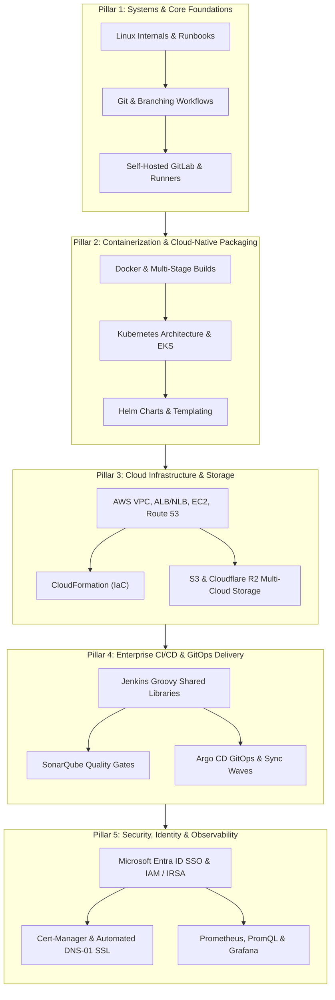

# DevOps & Cloud Engineering Interview Preparation Handbook 🚀

[](https://github.com/)
[](./aws_cheat_sheet.txt)
[](./kubernetes_cheat_sheet.txt)
[](./helm_cheat_sheet.txt)
[](./docker_cheat_sheet.txt)
[](./linux_cheat_sheet.txt)
[](./git_cheat_sheet.txt)
[](./jenkins_cheat_sheet.txt)
[](./argocd_cheat_sheet.txt)
[](./gitlab_admin_cheat_sheet.txt)
[](./iam_sso_cheat_sheet.txt)
[](./cert_manager_dns_cheat_sheet.txt)
[](./prometheus_grafana_cheat_sheet.txt)
[](./prometheus_grafana_cheat_sheet.txt)

A battle-tested, high-density collection of interview cheat sheets, architecture blueprints, CLI references, and production incident runbooks designed for **Senior DevOps Engineers, Site Reliability Engineers (SREs), Platform Engineers, and Cloud Architects**.

Each cheat sheet is structured specifically for technical interviews: conceptual definitions, CLI command tables, ASCII architecture diagrams, core comparison matrices, and real-world failure troubleshooting runbooks.

---

## 📑 Table of Contents

- [Quick Navigation Matrix](#-quick-navigation-matrix)
- [5-Pillar Recommended Study Roadmap](#-5-pillar-recommended-study-roadmap)
- [Module Highlights & Core Interview Concepts](#-module-highlights--core-interview-concepts)
  - [1. Linux for DevOps](#1-linux-for-devops)
  - [2. Git & Version Control](#2-git--version-control)
  - [3. Docker & Containerization](#3-docker--containerization)
  - [4. Kubernetes (K8s) & AWS EKS](#4-kubernetes-k8s--aws-eks)
  - [5. Helm Charts & Package Management](#5-helm-charts--package-management)
  - [6. AWS Cloud Infrastructure & Networking](#6-aws-cloud-infrastructure--networking)
  - [7. Jenkins CI/CD Automation & Groovy Shared Libraries](#7-jenkins-cicd-automation--groovy-shared-libraries)
  - [8. Argo CD & GitOps Continuous Delivery](#8-argo-cd--gitops-continuous-delivery)
  - [9. Self-Hosted GitLab Administration & Runners](#9-self-hosted-gitlab-administration--runners)
  - [10. Enterprise Identity, SSO (Entra ID) & Cloud IAM](#10-enterprise-identity-sso-entra-id--cloud-iam)
  - [11. Cert-Manager, SSL/TLS & DNS Automation](#11-cert-manager-ssltls--dns-automation)
  - [12. Prometheus & Grafana Observability](#12-prometheus--grafana-observability)
  - [13. Zabbix Enterprise Monitoring (Supplementary)](#13-zabbix-enterprise-monitoring-supplementary)
- [Production Incident Runbooks](#-production-incident-runbooks)
- [Repository Structure](#-repository-structure)
- [Interview Preparation Tips](#-interview-preparation-tips)

---

## ⚡ Quick Navigation Matrix

| Domain | Cheat Sheet File | Core Focus & Coverage | Target Senior Interview Questions |
| :--- | :--- | :--- | :--- |
| **AWS Cloud** | [`aws_cheat_sheet.txt`](./aws_cheat_sheet.txt) | VPC, subnets, IGW vs NAT GW, ALB vs NLB, ASG, S3 vs Cloudflare R2, Route 53, CloudFormation. | Security Group vs NACL, ALB vs NLB, S3 Egress vs R2, Multi-AZ vs Read Replica, VPC Endpoints. |
| **Kubernetes** | [`kubernetes_cheat_sheet.txt`](./kubernetes_cheat_sheet.txt) | Objects, Control Plane `"A E S C"`, Ingress flow, RBAC, AWS EKS, IRSA, AWS Load Balancer Controller. | StatefulSet vs Deployment, Ingress routing, IRSA token exchange, TargetGroupBinding IP mode. |
| **Helm** | [`helm_cheat_sheet.txt`](./helm_cheat_sheet.txt) | Helm 3 architecture, chart structure, templating syntax, `_helpers.tpl`, hooks, Argo CD Helm. | Helm 2 vs 3 (Tiller removal), Helm vs Kustomize, `version` vs `appVersion`, `upgrade --install`. |
| **Jenkins** | [`jenkins_cheat_sheet.txt`](./jenkins_cheat_sheet.txt) | Controller/Agent remoting, Groovy Shared Libraries (`vars/` vs `src/`), SonarQube quality gates, K8s agents. | `@Library` loading, `waitForQualityGate` webhook efficiency, Declarative dynamic Pod templates. |
| **Identity & SSO** | [`iam_sso_cheat_sheet.txt`](./iam_sso_cheat_sheet.txt) | Microsoft Entra ID (Azure AD), OIDC vs SAML, Dex OIDC in ArgoCD, Jenkins SSO, AWS STS, IRSA. | SAML vs OIDC, Group Claims mapping in `argocd-rbac-cm`, IRSA trust policies, Confused Deputy. |
| **Cert-Manager** | [`cert_manager_dns_cheat_sheet.txt`](./cert_manager_dns_cheat_sheet.txt) | Let's Encrypt ACME, HTTP-01 vs DNS-01, Cloudflare & Route 53 DNS solvers, Ingress-shim annotations. | HTTP-01 vs DNS-01, Wildcard certificate issuance, Let's Encrypt rate limits, troubleshooting stuck certs. |
| **GitLab Admin** | [`gitlab_admin_cheat_sheet.txt`](./gitlab_admin_cheat_sheet.txt) | Puma, Workhorse, Gitaly, Sidekiq, K8s runner autoscaling, `cache:` vs `artifacts:`, backups. | Runner autoscaling on K8s, `gitlab-secrets.json` backup trap, GitLab CI vs Jenkins vs GitHub Actions. |
| **Argo CD** | [`argocd_cheat_sheet.txt`](./argocd_cheat_sheet.txt) | GitOps CRDs (`Application`, `ApplicationSet`), Sync/Health states, Sync Waves, Phase Hooks. | Push vs Pull GitOps, Auto-Sync vs Self-Healing, Sync Waves vs Phases, Drift reconciliation. |
| **Docker** | [`docker_cheat_sheet.txt`](./docker_cheat_sheet.txt) | Dockerfile instructions, image lifecycle, build flags, multi-stage builds, caching. | `RUN` vs `CMD` vs `ENTRYPOINT`, `ARG` vs `ENV`, `COPY` vs `ADD`, `EXPOSE` vs `-p`. |
| **Linux** | [`linux_cheat_sheet.txt`](./linux_cheat_sheet.txt) | FHS, text processing (`grep`, `sed`, `awk`), networking (`ip`, `ss`, `curl`), permissions, systemd, runbooks. | Load averages, `lsof +L1`, Inode exhaustion, SIGTERM vs SIGKILL, Hard vs Soft links. |
| **Git** | [`git_cheat_sheet.txt`](./git_cheat_sheet.txt) | 3 Local Zones + Remote, CLI commands, branching models, merge conflict workflow. | Merge vs Rebase, Reset modes (`--soft`/`--mixed`/`--hard`), Trunk-Based vs GitFlow. |
| **Observability** | [`prometheus_grafana_cheat_sheet.txt`](./prometheus_grafana_cheat_sheet.txt) | TSDB, 4 metric types, PromQL queries, Grafana dashboards, 4 Golden Signals. | Pull vs Push model, `rate()` vs `irate()`, Histogram vs Summary, 4 Golden Signals. |
| **Zabbix** | [`zabbix_cheat_sheet.txt`](./zabbix_cheat_sheet.txt) | Server/Proxy/Agent architecture, LLD, item keys, trigger expressions, Zabbix vs Prometheus. | Active vs Passive checks, Agent 1 (C) vs Agent 2 (Go), Zabbix vs Prometheus, LLD automation. |

---

## 🗺️ 5-Pillar Recommended Study Roadmap

To prepare effectively for senior technical interviews, tackle these topics across five cohesive pillars:



---

## 🔍 Module Highlights & Core Interview Concepts

### 1. Linux for DevOps
📄 **File:** [`linux_cheat_sheet.txt`](./linux_cheat_sheet.txt)
- **Filesystem Hierarchy Standard (FHS):** `/proc` (virtual kernel process memory), `/sys` (hardware/subsystems), `/etc` (host configurations), `/var` (variable state & logs).
- **Core Distinctions:**
  - Hard Link (shares exact inode; cannot span filesystems) vs Soft Link (pointer path string; can cross filesystems).
  - `SIGTERM` (15, graceful signal, catchable) vs `SIGKILL` (9, uncatchable immediate termination).
  - Buffer (raw disk I/O blocks) vs Cache (RAM-cached file pages).

---

### 2. Git & Version Control
📄 **File:** [`git_cheat_sheet.txt`](./git_cheat_sheet.txt)
- **The 3 Local Zones (+ Remote):** Working Directory -> Staging Area (`git add`) -> Local Repo (`git commit`) -> Remote Repo (`git push`).
- **Core Distinctions:**
  - `git merge` (preserves branch history with explicit merge commit) vs `git rebase` (rewrites commit history for a linear graph).
  - `git reset` modes: `--soft` (keeps changes staged), `--mixed` (default, keeps changes unstaged in working directory), `--hard` (erases uncommitted changes).
  - Trunk-Based Development vs GitFlow.

---

### 3. Docker & Containerization
📄 **File:** [`docker_cheat_sheet.txt`](./docker_cheat_sheet.txt)
- **Lifecycle Pipeline:** Dockerfile -> `docker build` -> Image -> `docker run` -> Container.
- **Core Distinctions:**
  - `RUN` (build-time layer creation) vs `CMD` (default runtime arguments, easily overridden) vs `ENTRYPOINT` (primary runtime executable).
  - `ARG` (build-time only) vs `ENV` (build-time and container runtime).
  - `COPY` (transparent host-to-image copy) vs `ADD` (auto-extracts tar archives and downloads URLs).

---

### 4. Kubernetes (K8s) & AWS EKS
📄 **File:** [`kubernetes_cheat_sheet.txt`](./kubernetes_cheat_sheet.txt)
- **Control Plane `"A E S C"`:** `kube-apiserver` (API gateway), `etcd` (state store), `kube-scheduler` (pod placement), `kube-controller-manager` (reconciliation loops).
- **Worker Node Components:** `kubelet` (node agent), `kube-proxy` (network rules), `container runtime` (containerd).
- **AWS EKS Production Architecture:**
  - Managed Node Groups vs Karpenter high-performance autoscaling.
  - AWS VPC CNI (secondary private IPs directly on Pods).
  - AWS Load Balancer Controller with IP mode routing via `TargetGroupBinding`.
  - EBS CSI Driver (`gp3`) and EFS CSI Driver (`ReadWriteMany`).

---

### 5. Helm Charts & Package Management
📄 **File:** [`helm_cheat_sheet.txt`](./helm_cheat_sheet.txt)
- **Helm 3 Architecture:** Tiller completely removed; client-side security enforced via `kubeconfig` and RBAC; state stored as Kubernetes Secrets.
- **Chart Directory Structure:** `Chart.yaml`, `values.yaml`, `templates/`, `_helpers.tpl`, `charts/`.
- **Core Distinctions:**
  - Helm (parameterized Go template packaging) vs Kustomize (template-free YAML patching).
  - `version` (SemVer of the Helm chart) vs `appVersion` (SemVer of the container image).
  - `helm upgrade --install` (idempotent installation pattern for CI/CD).
  - Helm Hooks (`pre-install`, `pre-upgrade`, `hook-weight`, `hook-delete-policy`).

---

### 6. AWS Cloud Infrastructure & Networking
📄 **File:** [`aws_cheat_sheet.txt`](./aws_cheat_sheet.txt)
- **VPC Networking:** CIDRs, public vs private subnets, Internet Gateway vs NAT Gateway (cost, HA), Route Tables, VPC Peering vs Transit Gateway.
- **VPC Endpoints:** Gateway Endpoints (free, S3/DynamoDB) vs Interface Endpoints / PrivateLink (ENI with private IP).
- **Compute & Load Balancing:** Launch Templates, Auto Scaling Groups (ASG), ALB (Layer 7 path/host routing) vs NLB (Layer 4 ultra-low latency static IP).
- **Multi-Cloud Storage:** S3 Storage Classes & Lifecycle vs Cloudflare R2 ($0 egress fees for massive bandwidth savings).
- **DNS & Databases:** Route 53 (CNAME vs ALIAS record, routing policies), RDS (Multi-AZ synchronous HA vs Read Replicas asynchronous read scaling).
- **CloudFormation:** Template sections, Intrinsic functions (`!Ref`, `!GetAtt`, `!Sub`), Change Sets, and Drift Detection.

---

### 7. Jenkins CI/CD Automation & Groovy Shared Libraries
📄 **File:** [`jenkins_cheat_sheet.txt`](./jenkins_cheat_sheet.txt)
- **Groovy Shared Libraries:** Modularizing CI/CD across 20+ microservices:
  - `vars/` (global functions / custom pipeline steps, implementing `def call()`).
  - `src/` (standard Groovy OOP helper classes).
  - Ingestion: `@Library('my-shared-library') _`.
- **SonarQube Quality Gates:** `withSonarQubeEnv` execution and non-blocking `waitForQualityGate(webhook: true)` to release executor threads during gate calculation.
- **Dynamic Kubernetes Agents:** Defining multi-container pod templates in declarative syntax (Maven + Docker/Kaniko).

---

### 8. Argo CD & GitOps Continuous Delivery
📄 **File:** [`argocd_cheat_sheet.txt`](./argocd_cheat_sheet.txt)
- **GitOps Principles:** Git as the single source of truth; declarative manifests; automated drift reconciliation.
- **Architecture:** API Server, Repository Server, Application Controller, Redis cache.
- **Key Capabilities:**
  - Auto-Sync, Self-Healing, and Automated Pruning.
  - Phased deployments using **Sync Waves** (`argocd.argoproj.io/sync-wave`) and **Hooks** (`PreSync`, `Sync`, `PostSync`).

---

### 9. Self-Hosted GitLab Administration & Runners
📄 **File:** [`gitlab_admin_cheat_sheet.txt`](./gitlab_admin_cheat_sheet.txt)
- **Internal Subsystems:** Puma (Ruby web server), GitLab Workhorse (Go reverse proxy for Git HTTP & file transfers), Gitaly (Git RPC storage), Sidekiq (async jobs), PostgreSQL, Redis.
- **GitLab Runners:** Shared vs Group vs Specific; Kubernetes executor with dynamically autoscaling ephemeral build pods.
- **Disaster Recovery Trap:** `gitlab-backup create` DOES NOT backup `/etc/gitlab/gitlab-secrets.json`! Losing this file corrupts all encrypted database secrets and CI/CD variables.

---

### 10. Enterprise Identity, SSO (Entra ID) & Cloud IAM
📄 **File:** [`iam_sso_cheat_sheet.txt`](./iam_sso_cheat_sheet.txt)
- **Protocols:** SAML 2.0 (XML-based enterprise) vs OAuth 2.0 (authorization) vs OIDC (JSON/JWT identity).
- **Microsoft Entra ID (Azure AD) SSO Integration:**
  - App Registrations, Tenant ID, Client ID, Client Secrets, Redirect URIs, Group Claims.
  - Argo CD Dex OIDC configuration in `argocd-cm` and group role mapping in `argocd-rbac-cm`.
  - Jenkins Azure AD plugin and Matrix Authorization.
  - GitLab OmniAuth Azure AD integration.
- **AWS IAM & IRSA:** Cross-account STS `AssumeRole`, IRSA (IAM Roles for Service Accounts) in EKS via OIDC web identity token projection.

---

### 11. Cert-Manager, SSL/TLS & DNS Automation
📄 **File:** [`cert_manager_dns_cheat_sheet.txt`](./cert_manager_dns_cheat_sheet.txt)
- **Cert-Manager CRD Flow:** Ingress Annotation -> `Certificate` -> `CertificateRequest` -> `Issuer`/`ClusterIssuer` -> `Order` -> `Challenge` -> Secret.
- **HTTP-01 vs DNS-01 Challenges:**
  - HTTP-01: Ingress route verification on port 80 (cannot issue wildcard certs).
  - DNS-01: Automated TXT record creation via DNS APIs (Cloudflare, Route 53, GoDaddy); supports wildcard `*.domain.com` certificates and private clusters.
- **Ingress-Shim:** Auto-provisioning TLS secrets using `cert-manager.io/cluster-issuer` annotations.

---

### 12. Prometheus & Grafana Observability
📄 **File:** [`prometheus_grafana_cheat_sheet.txt`](./prometheus_grafana_cheat_sheet.txt)
- **4 Metric Types:** Counter (`rate()`), Gauge, Histogram (`histogram_quantile()`), Summary.
- **PromQL Critical Functions:** `rate(v[5m])` (smoothed per-second rate) vs `irate(v[1m])` (instantaneous rate for volatility).
- **The 4 Golden Signals (Google SRE):** Latency, Traffic, Errors, Saturation.

---

### 13. Zabbix Enterprise Monitoring (Supplementary)
📄 **File:** [`zabbix_cheat_sheet.txt`](./zabbix_cheat_sheet.txt)
- **Architecture:** Zabbix Server, SQL Database, Web Frontend, Zabbix Agent / Proxy.
- **Core Distinctions:** Active vs Passive agent checks, Agent 1 (C) vs Agent 2 (Go), Low-Level Discovery (LLD), Zabbix vs Prometheus.

---

## 🛠️ Production Incident Runbooks

These practical diagnostic runbooks are frequently asked in senior scenario-based interviews:

### Scenario A: High System Load & Unresponsive Server
```bash
# 1. Check load average vs core count
uptime
# 2. Inspect whether bottleneck is CPU (%us, %sy) or disk I/O wait (%wa)
top
# 3. If %wa is high, locate saturated disk partition and device
iostat -xz 1
# 4. Check memory exhaustion and OOM Killer invocations
free -h
dmesg -T | grep -i "oom"
```

### Scenario B: "No Space Left on Device" (100% Full Disk)
```bash
# 1. Identify 100% full filesystem
df -h
# 2. Find the top 10 largest folders consuming space
du -sh /* 2>/dev/null | sort -hr | head -n 10
# 3. If df -h shows 100% full but du does NOT find large files:
# Look for deleted files held open by running processes:
lsof +L1
# 4. Check for Inode exhaustion (zero blocks free vs zero inodes free):
df -i
```

### Scenario C: Cert-Manager Certificate Stuck in "Issuing"
```bash
# 1. Inspect the certificate state
kubectl describe certificate <cert-name> -n <namespace>
# 2. Inspect the ACME Challenge object to find the exact DNS / HTTP error
kubectl get challenge -n <namespace>
kubectl describe challenge <challenge-name> -n <namespace>
# 3. Common issues: Cloudflare API token expired/unauthorized, Route 53 IAM role missing,
#    or Let's Encrypt rate limit hit (switch to acme-staging for testing).
```

### Scenario D: Port Conflict / Service Unreachable
```bash
# 1. Identify which process is bound to the port
ss -tulpn | grep :<port>
# 2. Test TCP reachability from remote host
nc -zv <target-ip> <port>
# 3. Check iptables or UFW firewall blocking rules
sudo iptables -L -n -v
```

---

## 📁 Repository Structure

```text
devops_interview_preparation/
├── README.md                           # Main repository documentation & study portal
├── aws_cheat_sheet.txt                 # AWS VPC, subnets, ALB/NLB, S3/R2, Route 53, CloudFormation
├── kubernetes_cheat_sheet.txt          # K8s objects, control plane, EKS, IRSA, AWS Load Balancer Controller
├── helm_cheat_sheet.txt                # Helm 3 architecture, templates, hooks, Argo CD Helm integration
├── jenkins_cheat_sheet.txt             # Declarative pipelines, Groovy Shared Libraries, SonarQube, K8s agents
├── iam_sso_cheat_sheet.txt             # Microsoft Entra ID SSO (OIDC/SAML), ArgoCD/Jenkins SSO, AWS STS, IRSA
├── cert_manager_dns_cheat_sheet.txt    # Cert-Manager, Let's Encrypt, HTTP-01 vs DNS-01, Cloudflare & Route 53
├── gitlab_admin_cheat_sheet.txt        # Self-Hosted GitLab, K8s runner autoscaling, disaster recovery backups
├── argocd_cheat_sheet.txt              # GitOps architecture, CRDs, sync waves, and CLI
├── docker_cheat_sheet.txt              # Dockerfile reference, build options, CLI, lifecycle
├── linux_cheat_sheet.txt               # Linux FHS, systemd, commands, and triage runbooks
├── git_cheat_sheet.txt                 # Git zones, CLI, merge/rebase, branching, conflicts
├── prometheus_grafana_cheat_sheet.txt  # TSDB, 4 metric types, PromQL, Grafana, 4 Golden Signals
└── zabbix_cheat_sheet.txt              # Zabbix architecture, active/passive checks, LLD, items
```

---

## 💡 Interview Preparation Tips

1. **Be Concise with "One-Line Answers":**
   Interviewers look for crisp, precise definitions before diving deep. Use the "One-Line Answer" callouts provided in each cheat sheet (e.g., difference between `CMD` and `ENTRYPOINT`, `merge` vs `rebase`, or `HTTP-01` vs `DNS-01`).
2. **Anchor Answers in Your Real Resume Projects:**
   - When asked about CI/CD standardization, walk through your **Jenkins Groovy Shared Libraries** (`vars/` vs `src/`) and **SonarQube Quality Gate webhooks**.
   - When asked about SSL/TLS at scale, detail how you automated **wildcard renewals via Cert-Manager DNS-01 challenges** using Cloudflare and Route 53 APIs.
   - When asked about security governance, explain how you centralized **Microsoft Entra ID (Azure AD) SSO** across Jenkins and ArgoCD with Dex group-to-role mappings.
3. **Think in Failure Scenarios:**
   Senior interviews focus heavily on what to do when things break. Be ready to explain what happens when a disk is 100% full due to deleted files (`lsof +L1`), how to debug an Argo CD `OutOfSync` loop, or how to triage an ACME challenge failure in Cert-Manager.

---

*Happy Interviewing! Star ⭐ this repository if you find it helpful.*